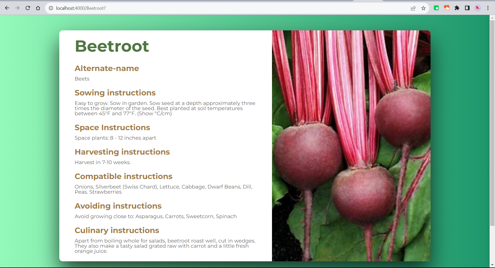

# Plant information search

This project's origin [here](https://github.com/weaviate/weaviate-examples/tree/main/plant-information-searching-using-NodeJs).

## Description
The goal of this project is to enable semantic search capabilities, allowing users to retrieve information of plants with a focus on meaning and context rather than just keywords. This is carried out using weaviate client!

https://user-images.githubusercontent.com/75658681/162991750-46430744-e68f-4990-98c7-a41f80d130c0.mp4

## Used technologies
1. Docker
2. JavaScript
3. CSS
4. Weaviate client

## Prerequisites
1. Install Docker and Docker-Compose
2. Install Node and npm

## Setup instructions
1. Run command `npm install` to install all the required node modules.
2. Make sure Docker file is running. 
3.  the add_data.js with command `node add_data.js` to add data 
4. After adding data run command `node index.js` and navigate to http://localhost:4000/ to perform searching

## Usage instructions
On http://localhost:4000/ , Use the search bar to search for the specific plant and click on the card to know more information.

## Dataset license
The dataset used for this example can be found here: https://data.world/sharon/vegetables-herbs-and-edible-flowers 
